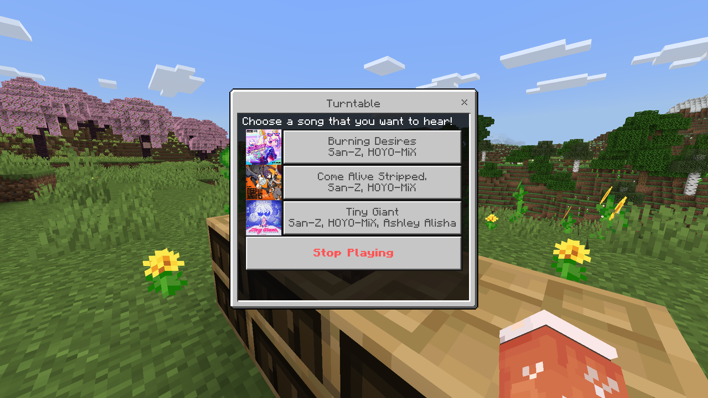

# Functional Turntable (Bedrock Add-On) Project

> This is an add-on that adds a functional turntable block into Minecraft Bedrock using the TypeScript language which will then be compiled into JavaScript.

## Features:
- You can selecting and listening to songs using Bedrock's built-in JSON UI.

## Known Bugs:
- Sometimes when you click on the song you want to play, **the song doesn't play** but the message from the song being played is conveyed to the player.
- The **block rotation on the turntable doesn't work at all** (I initially used an old rotation component that is not compatible with the latest version of Minecraft until I finally deleted the component and I don't really understand about new block components that are compatible with the latest version of Minecraft).
- The model of the turntable block itself is still not finalized (I'm too lazy to finish the model and it looks ugly :v).

## Guide:
- You can start coding in the "scripts" folder (not the scripts folder in the behavior pack).
- Type in Terminal: "tsc.cmd --watch" and run it to compile the TypeScript file to JavaScript and save it in the behavior pack.
- If you want to add a song, you have to convert the song to .ogg format first, then create its sound definitions in the Resource Pack, and implement the sound definitions into the script.
- And other things like adding new items, new blocks, and their components, or new entities, you can learn about them on [wiki.bedrock.dev](https://wiki.bedrock.dev/) or watch a tutorial on YouTube.

## Note:
I have deleted some files to avoid copyright claims such as songs and album covers, some of the deleted files include:
- RP/sounds/turntablerecord/burningdesire.ogg
- RP/sounds/turntablerecord/comealivestripped.ogg
- RP/sounds/turntablerecord/tinygiant.ogg
- RP/textures/ui_icons/burningdesires.png
- RP/textures/ui_icons/comealivestripped.png
- RP/textures/ui_icons/tinygiant.png

Warning: Maybe in the next few years, JSON UI will be gradually discontinued and replaced with [Ore UI](https://github.com/Mojang/ore-ui) which is based on React and TypeScript by Mojang, thus making add-ons containing JSON UI (including this project) will be broken.

Because that warning is the reason why I left this project. So the last thing, I'm really sorry if I can't make a good README :) (I'm still a beginner in the coding world).

**Regards from zilnatsu / FirezD (Author);
FirezD is my XBOX gamertag actually... heheh :v**
